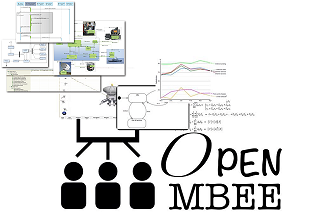

# OpenMBEE MMS Connector for Capella

This connector integrates the Open Source [Capella](https://www.eclipse.org/capella) MBSE solution [\[1\]](#References) into the [OpenMBEE](https://www.openmbee.org) engineering environment & ecosystem [\[2\]](#References).

## Capabilities

- [x] Push data from Capella to an MMS Repository
- [x] Pull data from an MMS Repository to Capella 
- [x] Manage versions and branches
- [x] Supports MMS 3.x [\[3\]](#References)
- [x] Supports Capella 1.3.x [\[4\]](#References)

## Documentation

See [Wiki](https://github.com/labs4capella/mms-capella/wiki).

## References

\[1\] : [https://github.com/eclipse/capella](https://github.com/eclipse/capella)

\[2\] : [https://github.com/Open-MBEE](https://github.com/Open-MBEE)

\[3\] : Support for MCF is currently under development, a specific branch has been created for that

\[4\] : Although the connector has been fully tested with Capella 1.3.x only, it should work with other major versions of Capella (if it doesn't, please let us known and open an [issue](https://github.com/open-mbee/mms-capella/issues))
